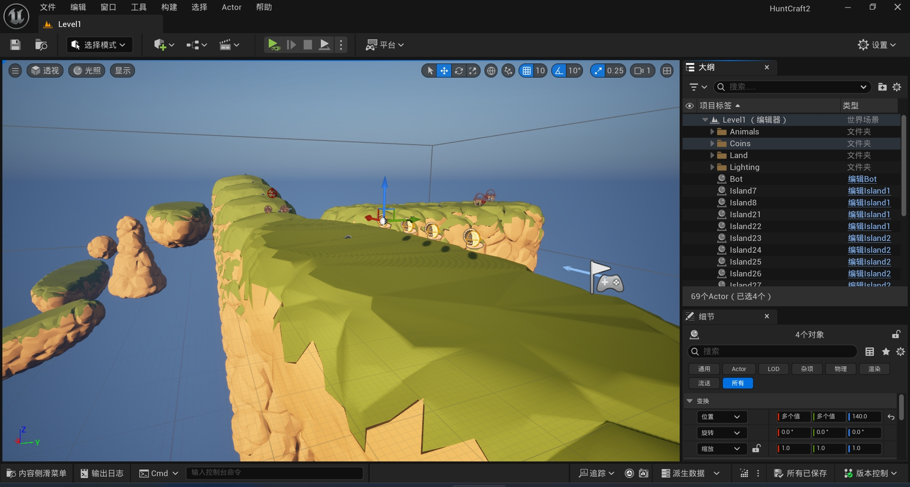

# UE5 VR Game Project

A virtual reality game project developed in Unreal Engine 5.5, integrating blockchain technology, zero-knowledge authentication, and AI-driven interactions. The project must be run within Unreal Engine as it is not yet packaged for standalone distribution.



## Features
- **DID Authentication**: Zero-knowledge proof-based decentralized identity (DID) login system replacing traditional IDP
- **NFT Weapons**: In-game weapons represented as non-fungible tokens (NFTs) on a blockchain
- **VR Mechanics**:
  - Parkour movement system optimized for VR
  - Archery combat with animal NPCs
- **AI Companion**: Smart agent that dynamically responds to player actions
- **Text-to-Speech**: Real-time voice generation for AI responses

## Requirements
- Unreal Engine 5.5
- Node.js (for zero-knowledge verification server)
- Installed Plugins:
  - `BlockChain` 
  - `RuntimeAudioImporter` 
  - `VaRestRequest` 
  - `UniversaTTX` 
- VR Hardware:
  - Meta Quest 3

## How to run
1. Clone repository to local machine

2. Open project in Unreal Engine 5.5

3. Install required plugins through Epic Marketplace/Plugin Manager

4. Run Zero-Knowledge verification server

    ```
    cd zk-verification-server
    node ./server.js
    ```

5. Run the game in the Unreal Engine
